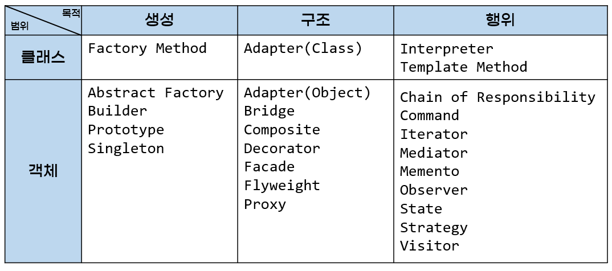

# Design Pattern - With Java

## Software Design Pattern
각 모듈의 세분화된 역할이나 모듈들 간의 인터페이스와 같은 코드를 작성하는 수준의 세부적인 구현 방안을
설계할 때 참조할 수 있는 전형적인 해결 방식 또는 예제

## GoF Design Pattern
* 논문 "_Using Pattern Languages for Object-Oriented Programs (1987)_ "  을 통해 제안됨
* 이후 23개의 패턴을 수록한 "_'GoF'(Gang of Fours). Design Patterns: Elements of Reusable Object-Oriented Software. (1995)_ " 를 통해 유명해짐

### 분류

1. 목적에 따른 분류
   1. 생성 패턴: 객체의 생성 과정에 관여
   2. 구조 패턴: 객체의 합성에 관여
   3. 행동 패턴: 객체가 상호작용하는 방법이나 관심사를 분리하는 방법에 관여
2. 범위에 따른 분류
   1. 클래스 패턴
      * 패턴을 주로 클래스에 적용
      * 클래스와 서브 클래스 간의 관련성을 다룸
      * 주로 상속을 통해 관련되며, 컴파일 타임에 정적으로 결정됨
   2. 객체 패턴
      * 패턴을 주로 객체에 적용
      * 객체 간의 관련성을 다룸
      * 런타임에 변경될 수 있는 동적인 성격을 가짐
---
## 생성 패턴
> 생성 패턴은 객체의 생성과 관련된 패턴이다. 객체의 인스턴스 과정을 추상화하는 방법이다. 
> 객체의 생성과 참조 과정을 캡슐화하여 객체가 생성되거나 변경되어도 프로그램 구조에 영향을
> 받지 않도록 하여 프로그램에 유연성을 더해준다. <u>*생성 클래스 패턴*</u> 은 객체를 생성하는 일부를 서브클래스가 담당하도록 하며,
> <u>*>생성 객체 패턴*</u> 은 객체 생성을 다른 객체에게 위임한다.

* ~~Singleton~~
* ~~Abstract Factory~~
* ~~Builder~~
* ~~Factory Method~~
* ~~Prototype~~

## 구조 패턴
> 구조 패턴은 클래스나 객체들을 조합해 더 큰 구조로 만들 수 있게 해주는 패턴이다.
> <u>*구조 클래스*</u> 패턴 은 상속을 통해 클래스나 인터페이스를 합성하고,
> <u>*구조 객체 패턴*</u> 은 객체를 합성하는 방법을 정의한다.

* ~~Adaptor~~
* ~~Bridge~~
* ~~Composite~~
* ~~Decorator~~
* ~~Facade~~
* ~~Flyweight~~
* Proxy

## 행위 패턴
> 행위 패턴은 클래스나 객체들이 서로 상호작용하는 방법이나 어떤 태스크, 어떤 알고리즘을 어떤 객체에 할당하는 것이 좋을지를
> 정의하는 패턴이다. 즉, 객체나 클래스의 교류 방법에 대해 정의하는 것이다. 행위 패턴은 하나의 객체로 수행할 수 없는 작업을
> 여러 객체로 분배하면서 그들 간의 결합도를 최소화 할 수 있도록 도와준다. <u>*행위 클래스 패턴*</u> 은 상속을 통해 
> 알고리즘과 제어 흐름을 기술하고, <u>*행위 객체 패턴*</u> 은 하나의 작업을 수행하기 위해 객체 집합이 어떻게 협력하는지를
> 기술한다.

* ~~Chain of Responsibility~~
* ~~Command~~
* ~~Mediator~~
* ~~Memento~~
* ~~Observer~~
* ~~Status~~
* ~~Strategy~~
* ~~Template Method~~
* ~~Visitor~~
* Interpreter
* Iterator